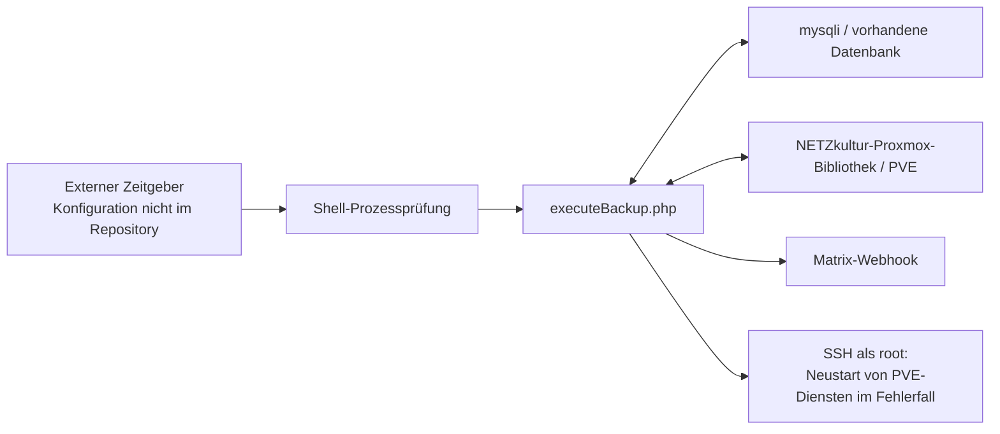

# 1. Ist-Analyse der alten Version

Quelle: [NETZkultur/proxmox-backup](https://gitea.netzkultur.dev/NETZkultur/proxmox-backup), frisch gelesener Commit `b0bbb7e441e96d410b1be6209542dd7deb6a407b`, Branch `master`. Der SSH-Ref-Abgleich ergab genau diesen einen veröffentlichten Branch. Die Aussagen beziehen sich auf diesen Repositoryzustand, nicht auf möglicherweise zusätzliche Programme oder lokale Änderungen des produktiven Servers.

## 1.1 Vollständiger Repositoryumfang

| Datei | Inhalt und Bedeutung |
| --- | --- |
| `executeBackup.php`, 1.224 Zeilen | Gesamter Produktionsablauf: DB-Konfiguration, PVE-Zugriff, Inventarpflege, Queue, Starts, Monitoring, Archiv und Matrix-Bericht. |
| `library/config.php`, 142 Zeilen | SQL-basierte Konfiguration für globale Freigabe, Datacenter, Zugangsdaten, Nodes und Backupziele. |
| `executeBackup.sh` | Prozesssuche mit `ps`/`grep`; Start über fest eingetragenen PHP-7.2-Pfad. |
| `executeBackupScriptAlreadyRunning.php`, 12 Zeilen | Matrix-Nachricht bei bereits gefundenem Prozess. |
| `authentication.sample.php`, 18 Zeilen | Beispiel für lokale Authentifizierungskonfiguration. Die tatsächliche `authentication.php` ist nicht eingecheckt. |
| `test.php`, 26 Zeilen | Manuelles Login-Skript, keine automatisierte Testsuite; enthält fest eingetragene Authentifizierungswerte. |
| `composer.json`, 33 Zeilen | PHP `>=7.0`, cURL, JSON, mysqli, eigener NETZkultur-Proxmox-Fork und GoogleAuthenticator. |
| `.gitignore`, `.gitattributes`, `.DS_Store` | Repositorymetadaten einschließlich eingecheckter Desktopmetadaten. |

Es gibt **keinen** eingecheckten Datenbank-Schemaexport, keine Migrationen, keinen Lockfile, keine CI, keine Unit-/Contract-Tests, keine Containerdefinitionen und keine Weboberfläche. `vendor/` ist nicht enthalten. Damit ist der genaue damalige Code der Proxmox-Bibliothek aus diesem Checkout nicht reproduzierbar.

## 1.2 Tatsächliche Architektur und Ablauf

Der Ablauf ist ein endlicher Durchlauf, kein dauerhaft laufender Collector mit eigenem Taktgeber:

1. Lokale Datenbankzugangsdaten und Composer-Autoloader laden; mysqli-Verbindung öffnen.
2. Nur bei globalem Konfigurationswert `'true'` weiterarbeiten.
3. Aktivierte Datacenter, ihre aktivierten Nodes und vorkonfigurierten Backupziele aus SQL lesen.
4. Pro konfiguriertem Node anmelden, Storage-Kapazität lesen, QEMU-Liste abfragen.
5. Bei erfolgreicher QEMU-Antwort bekannte Gäste des Nodes archiviert markieren, Zuordnungen löschen und beobachtete Gäste wieder eintragen; `state` und `diskwrite` speichern.
6. Für gespeicherte offene Backupläufe Taskstatus prüfen. Gestoppte Tasks als Erfolg oder Fehler abschließen; weiter laufende Tasks sperren ihren Node.
7. Queue über drei aufeinanderfolgende SQL-Projektionen aufbauen beziehungsweise Gründe aktualisieren.
8. Alte Queue-Messwerte löschen; abgeschlossene Backupläufe nach acht Tagen in eine Archivtabelle verschieben.
9. Je Datacenter/Storage freie Slots bestimmen und die drei Prioritätsklassen nacheinander abarbeiten.
10. `vzdump` absenden, bei akzeptierter Antwort den UPID als Job speichern und den Queueeintrag löschen.
11. Status, Warteschlangen, Langläufer und knappe Storages als Text ausgeben und an Matrix senden.

Belege: [Inventar und Monitoring, Zeilen 1–210](https://gitea.netzkultur.dev/NETZkultur/proxmox-backup/src/commit/b0bbb7e441e96d410b1be6209542dd7deb6a407b/executeBackup.php#L1), [Queueaufbau ab Zeile 212](https://gitea.netzkultur.dev/NETZkultur/proxmox-backup/src/commit/b0bbb7e441e96d410b1be6209542dd7deb6a407b/executeBackup.php#L212), [Ausführung ab Zeile 1074](https://gitea.netzkultur.dev/NETZkultur/proxmox-backup/src/commit/b0bbb7e441e96d410b1be6209542dd7deb6a407b/executeBackup.php#L1074).

## 1.3 Fachliche Regeln, die tatsächlich vorhanden sind

| Regel | Altverhalten |
| --- | --- |
| Aktivierung | Globale Freigabe sowie aktivierte Datacenter, Nodes, QEMU-Gäste und Storages; archivierte Gäste ausgeschlossen. |
| Auswahl | Über Datenbankkonfiguration; keine im Repository vorhandene Auswahloberfläche. |
| Gasttypen | Ausschließlich QEMU. |
| `noBackup` | Kein in der aktuellen Jobtabelle gefundener Lauf mit `state IN ('success','running')`; ausschließlich frühere Fehler erfüllen diese Bedingung. |
| `toOld` | Startzeit des jüngsten erfolgreichen/laufenden Jobs liegt strikt vor `now - maxBackupAgeInSeconds`. |
| `bytesWritten` | Zählerdifferenz strikt über Gastschwelle und letzter erfolgreicher/laufender Start strikt älter als Gast-Cooldown. |
| Vorrang | Queueprojektion schreibt zuerst Bytes, danach Alter, zuletzt „kein Backup“. Startschleifen bearbeiten `noBackup`, `toOld`, `bytesWritten` in dieser Reihenfolge. |
| Reihenfolge innerhalb der Klasse | Gastauswahl pro Node nach `scheduledAt ASC`; kein ausdrücklicher stabiler ID-Tiebreaker. Auch die vorgeschaltete Nodeauswahl ist nicht vollständig sortiert. |
| Nodeparallelität | Bekannte laufende Jobs führen zur Aufnahme in eine lokale Skip-Liste; nach erfolgreichem Start wird derselbe Node für diesen Durchlauf ebenfalls übersprungen. |
| Zielparallelität | Fester `concurrentJobs`-Wert oder `-1` als Anzahl zugeordneter Nodes, jeweils abzüglich aktuell offener Jobs. |
| Freiplatz | Auf ganze GiB abgerundet; Startvergleich strikt `currentFreeDiskSpaceInGB > minimumRequiredFreeDiskSpaceInGB`. Kein explizites Zeitstempel-/Freshness-Gate. |
| Backupmodus | Im ausführenden Code fest `snapshot`, kein wirksamer Modus-Override. |
| Kompression und Retention | Defaults am Storage und nullable Gast-Overrides; `remove` und `prune-backups` werden gesendet. |
| PVE-Mail | Fest eingetragener Empfänger und `mailnotification=failure`. |
| Erfolg | Gestoppter Task mit `exitstatus === 'OK'`; der Statusvergleich sucht „stopped“ als Teilzeichenfolge. |
| Gastentfernung/Wiederkehr | Nach erfolgreichem Node-Read zunächst archivieren, beobachtete Gäste anschließend reaktivieren. |
| Historie | Aktuelle und archivierte Jobtabellen; Queue-Messwerte für acht Tage. |
| Berichte | Zusammenfassung je Datacenter und Node; Queue-Mittelwerte über 1 Stunde, 12 Stunden, 1 Tag, 7 Tage; Warnung bei Läufen über zwei Tagen und zu wenig Platz. |

Die Klassenpriorität ist innerhalb der verschachtelten Datacenter-/Storage-Verarbeitung implementiert. Eine globale, atomar serialisierte Queueordnung über alle Ziele gibt es nicht. Die konkreten Unique Keys, Defaults und Trigger der Altdatenbank sind ohne Schemaexport nicht nachprüfbar; der Code setzt sie bei `INSERT IGNORE`/`ON DUPLICATE KEY UPDATE` voraus.

## 1.4 Datenmodell aus tatsächlichen Zugriffen

Die folgenden Tabellen lassen sich direkt aus den SQL-Zugriffen ableiten:

| Gruppe | Tabellen |
| --- | --- |
| Konfiguration | `config_core`, `config_pve_datacenter`, `config_pve_authentications`, `config_pve_nodes`, `config_pve_backup_locations`, `config_pve_node_to_backup_location` |
| Gäste und aktueller Zustand | `config_pve_qemus`, `config_pve_qemu_to_node`, `pve_qemu_current_state` |
| Planung und Ausführung | `pve_scheduled_backup_jobs`, `pve_backup_jobs` |
| Historie und Metriken | `pve_backup_jobs_archive`, `pve_scheduled_backup_job_count` |

Wesentliche Identitätsproblematik: Historie und Messzustand sind an Datacenter, **Node** und QEMU-ID gekoppelt. Ein Gastwechsel kann damit die Zuordnung zum bisherigen erfolgreichen Backup verlieren. V2 benötigt deshalb die vom aktuellen Placement getrennte Gastidentität.

Die im Rewrite-Plan genannten Zahlen zu Datacentern, Nodes, Gästen, Millionen Archivzeilen und veralteten Queueeinträgen stammen aus einer früheren produktiven DB-Prüfung. Sie wurden in diesem Audit **nicht** aktualisiert und sind keine Aussage über den heutigen Betrieb.

## 1.5 Konkrete Schwachstellen

### A1: Authentifizierungsgeheimnisse im Repository

Die eingecheckte Datei `test.php` enthält zwei fest eingetragene Passwortwerte und ein TOTP-Geheimnis für beispielhaft beziehungsweise tatsächlich adressierte Systeme. Ob diese Werte noch gültig sind, wurde nicht getestet. Sie müssen als offengelegt behandelt und ihre Ablösung geprüft werden. Die Werte und Zieladressen werden hier nicht wiedergegeben. Eine Entfernung aus der aktuellen Datei allein ersetzt keine Rotation.

Außerdem werden PVE-Credentials in `Config::getEnabledDatacenterConfigurations()` unmittelbar aus Spalten für Passwort, TOTP und Token gelesen. Der gezeigte Anwendungspfad enthält keine Entschlüsselungs- oder Zwecktrennung. Ob außerhalb der Anwendung zusätzliche Schutzmaßnahmen bestanden, ist nicht erkennbar.

### A2: Kein belastbarer Schutz vor Doppelstarts

`ps | grep` ist keine atomare Sperre. Zwei gleichzeitige Starts können beide „kein Prozess“ beobachten. SQL-Queueprüfung, HTTP-POST und Speicherung sind nicht durch eine Lease-/Fencing-Transaktion verbunden. Der UPID wird erst **nach** dem Remote-Start gespeichert. Geht die Antwort verloren oder scheitert das anschließende INSERT, kann ein Remote-Backup ohne entsprechenden lokalen Lauf existieren und später erneut angefordert werden.

### A3: Transienter Lesefehler wird als definitives Backupversagen gewertet

Liefert die Taskstatus-Abfrage kein erwartetes Objekt, setzt der Code den Lauf auf `failure` und beendet ihn lokal. Das beweist nicht, dass der Remote-Task beendet ist. Dadurch kann auch die Node-Sperre entfallen, während das Backup noch läuft. Eine Reconciliation existiert nicht.

### A4: Fehlerbehandlung verändert die PVE-Infrastruktur

Bei einer bestimmten Login-Fehlermeldung startet `loginToNode()` per SSH als `root` die Dienste `pvedaemon` und `pveproxy` neu; Host-Key-Prüfung wird dabei deaktiviert. Die aufrufenden Stellen prüfen den zurückgegebenen Login-Erfolg nicht konsequent. Monitoring und Ausführung sind damit mit privilegierten Reparaturversuchen gekoppelt.

### A5: Tatsächlich gewähltes Storage ist nicht sauber an den geprüften Slot gebunden

Die äußere Schleife prüft Kapazität und Parallelität eines konkreten Backupziels. `executeBackup()` erhält jedoch nur Datacenter, Node und Gast, keine Ziel-ID. Die innere SQL-Abfrage verbindet erneut alle Node-/Storage-Zuordnungen und verwendet die erste Ergebniszeile. Bei mehreren zulässigen Zielen eines Nodes kann so ein anderes Storage ausgewählt werden als dasjenige, dessen Slots vorher geprüft wurden. Das ist aus dem Funktions- und Abfragevertrag ableitbar; eine konkrete produktive Mehrfachzuordnung wurde nicht untersucht.

### A6: Veraltete oder unzuverlässige Messwerte

Fehlgeschlagene Kapazitätsreads lassen den alten Zahlenwert bestehen. Es gibt kein Frischealter und keine Reservierung erwarteter Backupgrößen. Die Liste bereits gelesener Storages erhält zudem das gesamte Backup-Location-Array statt des überprüften Namens; die beabsichtigte Read-Deduplizierung funktioniert damit nicht korrekt. Zählerresets von `diskwrite` besitzen keine ausdrücklich modellierte Semantik.

### A7: Nicht atomare Inventar- und Archivoperationen

Archivieren, Entfernen der Placements und erneutes Einfügen erfolgen in einzelnen SQL-Statements ohne umfassende Transaktion. Abbrüche können einen Zwischenzustand hinterlassen. Ein erfolgreicher HTTP-Read wird als vollständige Nodeinventarsicht behandelt; eine begrenzte ACL-Sicht oder unvollständige Antwort hat keinen eigenen Autoritätsstatus.

### A8: SQL-Zusammenbau mit nicht durchgehend escapten Werten

Gastnamen und weitere externe Werte werden direkt in SQL-Strings eingebaut. Bereits ein unerwartetes Hochkomma kann Abfragen beschädigen; weitergehende Injection-Risiken hängen von der Kontrolle dieser Daten ab. Prepared Statements und ein konsistentes Fehlermapping fehlen.

### A9: Historische Erfolgsbasis und Metriken sind fachlich fragil

Erfolgreiche Läufe werden nach acht Tagen aus der Tabelle entfernt, aus der der Scheduler seine Erfolgsbasis liest; das Archiv wird dort nicht einbezogen. Bei langen Backupabständen kann ein vormals gesicherter Gast wieder als `noBackup` gelten. Queuezählungen werden innerhalb einer Datacenter-Schleife jeweils erneut für **alle** Datacenter geschrieben. Lokale SQL-Zeit und Zeitformatierung sind mit Fachlogik vermischt.

### A10: Betrieb und Lieferkette sind nicht reproduzierbar abgesichert

Ungepinntes `dev-master`, Wildcard-Abhängigkeit, fehlender Lockfile und `secure-http: false` verhindern eine belastbare Reproduktion der installierten Dependencies. Der Runner verweist auf einen PHP-7.2- und Hostpfad. Für Matrix gibt es keinen geprüften Zustellstatus, keine persistierte Outbox und keinen nachweisbaren Retry-Vertrag.

**TLS-Nachweisgrenze:** Der frühere Rewrite-Plan beschreibt deaktivierte PVE-TLS-Prüfung in der alten Bibliothek. Diese Bibliothek ist im aktuellen Alt-Checkout nicht enthalten; ihr damaliger installierter Stand und ihre Defaults wurden deshalb hier nicht unabhängig bestätigt. Die deaktivierte SSH-Host-Key-Prüfung und `secure-http: false` sind dagegen unmittelbar im Repository sichtbar.

## 1.6 Korrekturen gegenüber der bisherigen Altbeschreibung

| Bisherige Verkürzung | Präziser Befund |
| --- | --- |
| „Installationen scannen“ als reine Funktionsparität | Alt liest QEMU und Kapazität bereits konfigurierter, aktivierter Nodes/Storages. Vollständige Installationserkennung, neue Nodes, PBS und Capabilities sind V2-Erweiterungen. |
| Auswahl in einer WebApp | Im Alt-Repository nicht vorhanden. Die DB-Konfiguration besitzt Auswahlwirkung, aber keine mitgelieferte Bedienoberfläche. |
| Backupmodus als Storage-Default mit Gast-Override | Kompression und Retention ja; Modus im ausgeführten POST fest `snapshot`. |
| Frische Kapazität als bestehende explizite Regel | Alt versucht vorher zu lesen, speichert aber kein belastbares Freshness-Gate. V2 ergänzt eine notwendige Schutzregel. |
| Vollständig stabile Prioritäts-/FIFO-Ordnung | Alt hat Klassenfolge und `scheduledAt`, aber keine globale Transaktionsordnung und keinen stabilen ID-Tiebreaker. |
| Vollständige Tests beziehungsweise nachvollziehbares Schema | Beides im Alt-Repository nicht vorhanden. |

Die Rewrite-Entscheidung ist fachlich gut begründet. Bewahrt werden sollen die Backupabsicht und Prioritätsregeln; zahlreiche V2-Anforderungen sind bewusste Verbesserungen und neue Funktionen, keine wortgetreue Übernahme vorhandenen Altverhaltens.
