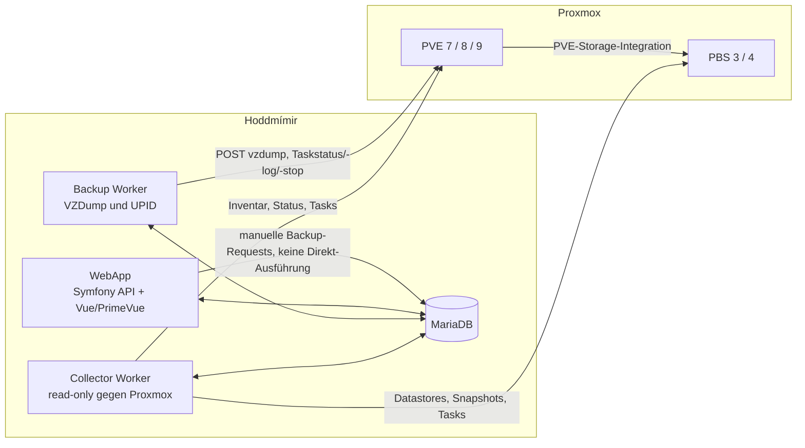

# Rewrite-Plan: Hoddmímir 2.0

Stand: 13. Juli 2026

## 1. Ziel und verbindlicher Scope

Das bestehende Projekt unter `/Users/tobias.pottgueter/Entwicklung/proxmox-backup` wird fachlich analysiert, aber nicht weiterentwickelt. Der Rewrite entsteht als neue Version 2.0 unabhängig im Repository `hoddmimir`.

V2.0 ist ein **Clean Start**: Die Datenbank wird leer neu aufgebaut und das System vollständig neu konfiguriert. Es gibt keinen Import aus der alten Datenbank und keine Übernahme von Verbindungen, Credentials, Policies, Inventar, Queue, Laufzuständen, Metriken oder Backup-Historie.

Auch das Datenbankschema wird nicht nachgebaut. Tabellen, Spalten, Schlüssel und Zustände werden ausschließlich aus der V2-Domäne und ihren Zugriffsmustern entworfen. Rückwärtskompatibilität zum alten Schema ist ausdrücklich kein Ziel.

Der Zielumfang besteht aus genau drei Applikationskomponenten:

1. **Collector Worker** für PVE-/PBS-Erkennung, Inventar, Laufzeitdaten und Scheduler-Entscheidungen.
2. **Backup Worker** für atomisches Claiming, Start, Überwachung, Abbruch und Reconciliation von Backups.
3. **WebApp** mit PHP-Backend sowie Vue-/PrimeVue-Frontend für Darstellung, Steuerung und Administration.

Verbindliche Plattformen und Leitplanken:

- Proxmox VE 7, 8 und 9.
- Proxmox Backup Server 3 und 4.
- Eigene PVE- und PBS-API-Adapter; keine Abhängigkeit von `saleh7/proxmox-ve_php_api` oder `netzkultur/proxmoxve-php-api`.
- PHP 8.5 für Worker und WebApp-Backend.
- Vue 3, TypeScript, PrimeVue 4, Vite, Pinia und Vue Router für das Frontend.
- MariaDB als einzige persistente Datenbank.
- Alpine-basierte Laufzeit-Images für alle drei Applikationskomponenten.
- Vollständige automatisierte Tests für sämtliche testbare Fachlogik; reale Systemgrenzen werden zusätzlich mit Contract-, Integrations- und End-to-End-Tests geprüft.
- QEMU-VMs und LXC-Container sind im neuen Domänenmodell gleichberechtigte Gäste.

Nicht Teil des Rewrite sind die Übernahme alten PHP-Codes, der alten Proxmox-Clientbibliotheken oder irgendwelcher Daten aus dem Altsystem.

### 1.1 Verpflichtende Funktionsparität

Die folgenden vier Funktionen sind Release-Blocker. Eine technisch vollständige Plattform ohne diese Bedien- und Scheduler-Funktionen gilt nicht als V2.0.

#### PVE-/PBS-Installationen scannen

- Nach dem Anlegen mindestens eines API-Endpunkts und Tokens scannt der Collector die vollständige konfigurierte PVE- beziehungsweise PBS-Installation.
- Der Collector läuft kontinuierlich und startet die Scans automatisch in einem standardmäßigen 120-Sekunden-Takt. Das Intervall bleibt eine Laufzeit-/Deployment-Konfiguration; die WebApp und ihre API bieten bewusst weder einen manuellen Scan-Endpunkt noch eine Aktion „Jetzt scannen“.
- Die fachliche Scanplanung verwendet ein startzeitbasiertes Raster mit standardmäßig 120 Sekunden Breite; ein Deployment-Override verändert nur diese Rasterbreite. Scanzyklen dürfen sich niemals überlappen. Dauert ein Zyklus über einen oder mehrere Rasterpunkte hinaus, werden alle verpassten Ticks übersprungen und nur der nächste zukünftige Rasterpunkt geplant; es gibt weder Sofort-Nachholungen noch einen Catch-up-Sturm.
- Angezeigt werden Produkt, Version, Cluster/Server, erkannte Objekte, Dauer, letzter erfolgreicher Lauf, Teilfehler und nächster Lauf.
- Mehrere PVE-Endpunkte desselben Clusters dienen als Failover und erzeugen kein doppeltes Inventar.
- Ein Teilfehler oder nicht erreichbarer Node ist kein autoritativer Nachweis für eine Entfernung. Bekannte Objekte werden erst nach einem vollständigen erfolgreichen Scan als fehlend markiert oder archiviert.
- „Scannen“ bezeichnet hier die Inventarisierung einer konfigurierten API-Verbindung. Ein blindes CIDR-/Netzwerk-Discovery ist kein Bestandteil der bisherigen Funktion und wird nicht vorausgesetzt.

#### Nodes, VMs und CTs für Backups auswählen

- Die WebApp zeigt nach dem Scan eine Auswahlhierarchie aus Installation, Cluster, Node und Gast.
- Nodes, QEMU-VMs und LXC-Container lassen sich einzeln sowie per Massenaktion ein- und ausschließen.
- Ein Gast ist nur zulässig, wenn Verbindung, Cluster, aktueller Node, Gast, Policy und Ziel aktiviert sind; ein explizites Ausschließen gewinnt immer.
- Wechselt ein Gast den Node, wird seine aktuelle Platzierung verwendet. Ist der neue Node nicht ausgewählt, wird kein Backup gestartet und der konkrete Sperrgrund angezeigt.
- Jede Scheduler-Entscheidung speichert und zeigt, welche Auswahl- und Gate-Regeln wirksam waren.

#### Backuplocations auswählen

- Der Collector erkennt PVE-Storages, die Backup-Content unterstützen, sowie PBS-Server, Datastores und Namespaces.
- Eine Policy wählt ein konkretes aktiviertes PVE-Storage als `vzdump`-Ziel.
- Bei PBS-Zielen zeigt und validiert die WebApp die Zuordnung von PVE-Storage zu PBS-Server, Datastore und optionalem Namespace.
- Das Ziel muss auf dem aktuellen Node verfügbar, für den Executor berechtigt und mit einem frischen Kapazitätswert versehen sein.
- Mindestfreiplatz, Parallelität, erlaubte Nodes und Policy-Zuordnungen sind pro Ziel administrierbar.
- Ungültige oder nicht mehr erreichbare Kombinationen lassen sich nicht aktivieren und blockieren bestehende Requests mit einem sichtbaren Grund.

#### Backups nach den bestehenden Regeln priorisieren

- Automatische Prioritätsklassen bleiben exakt `never_backed_up` vor `max_age` vor `bytes_written`.
- `never_backed_up` gilt auch dann, wenn ausschließlich fehlgeschlagene frühere Läufe existieren.
- Treffen mehrere Gründe gleichzeitig zu, wird nur der höchstpriorisierte Grund verwendet.
- Numerische Prioritäten: manuell `400`, noch kein Backup `300`, maximales Alter `200`, Schreibvolumen `100`.
- Ein Retry behält Grund und Priorität des ursprünglichen Requests und bildet keine neue Prioritätsklasse.
- Innerhalb einer Klasse gilt FIFO nach `scheduled_at`, danach eine stabile ID.
- Alter und Cooldown sind wie bisher erst nach Überschreiten der Grenze erfüllt; die Byte-Regel gilt bei einer Differenz oberhalb des Schwellwerts. Sämtliche Gleichheitsgrenzen werden explizit unitgetestet.
- Node- und Ziel-Fairness dürfen nur innerhalb derselben Prioritätsklasse umsortieren, niemals die vier Klassen vertauschen.
- Die bestehenden Enable-Gates, ein aktiver Job je Node, Storage-Parallelität und Mindestfreiplatz bleiben zusätzliche Startbedingungen.

## 2. Verifizierter Ist-Stand

### 2.1 Altanwendung

Die produktive Anwendung ist ein zeitgesteuerter PHP-Monolith. `executeBackup.php` koppelt auf 1.224 Zeilen:

- PVE-Login und API-Aufrufe,
- Storage- und QEMU-Inventar,
- Scheduler-Entscheidungen,
- Backup-Start,
- UPID-Monitoring,
- Archivierung,
- Queue-Metriken,
- Matrix-Berichte.

Der Prozessschutz erfolgt über `ps | grep`. TLS- und Host-Verifikation sind in der alten Proxmox-Bibliothek standardmäßig deaktiviert. Das Modell kennt nur QEMU und keine direkte PBS-API.

Zu bewahrende fachliche Regeln:

- globale sowie Datacenter-, Node-, Gast- und Storage-spezifische Enable/Disable-Gates;
- ausgeschlossene archivierte Gäste;
- Backup-Gründe `never_backed_up`, `max_age` und `bytes_written` mit Cooldown;
- Priorität `never_backed_up > max_age > bytes_written`;
- maximal ein aktiver Scheduler-Job je Node;
- feste Storage-Parallelität oder dynamisch ein Slot je zugeordnetem Node;
- Start nur bei ausreichendem und frischem Kapazitätswert;
- Storage-Defaults für Modus, Kompression und Retention mit optionalen Gast-Overrides;
- Task-Erfolg nur bei `status=stopped` und `exitstatus=OK`;
- Historie und Queue-Verlauf bleiben administrativ sichtbar;
- entfernte Gäste werden archiviert und bei Wiederauftauchen reaktiviert.

Nicht übernommen werden Prozess-Locks, SSH-Neustarts von PVE-Diensten, lokale Serverzeit, implizite SQL-Zustandsautomaten, deaktivierte TLS-Prüfung und sofortige endgültige Fehler bei transienten Task-API-Problemen.

### 2.2 MariaDB, strikt lesend geprüft

Die produktive Datenbank `proxmox_backup` lief während der Prüfung weiter. Die Session wurde als read-only verifiziert; es gab keine Änderungen.

- MariaDB 10.5.9, InnoDB, `utf8`/`utf8_unicode_ci`, lokale Systemzeitzone.
- 5 Datacenter, 20 Nodes, 7 Backup-Ziele.
- 1.162 bekannte QEMU-Gäste, davon 978 mit aktueller Node-Zuordnung.
- ungefähr 47.000 aktuelle und 5,12 Millionen archivierte Backup-Läufe.
- ungefähr 115.000 Queue-Messwerte.
- 1.317 von 2.295 Current-State-Zeilen haben keine aktuelle Gast-Node-Zuordnung.
- Beim Snapshot waren 71 von 74 Queue-Einträgen wegen veralteter Platzierungen nicht ausführbar.
- Queue-Metriken werden im Altcode mehrfach identisch geschrieben.

Konsequenzen für V2.0:

- Die Alt-Datenbank war ausschließlich eine lesende Quelle zum Verständnis der Fachlogik und ihrer Schwächen.
- Es werden keine Konfiguration, Credentials, Policies, Gäste, Jobs, Historien, Queue-Einträge, Current-State-Daten oder Metriken übernommen.
- Die V2-Datenbank startet leer mit dem neuen Schema.
- Verbindungen, Ziele und Policies werden über die neue WebApp vollständig neu angelegt.
- Der Collector baut das gesamte Inventar ausschließlich aus den neu konfigurierten PVE-/PBS-Verbindungen auf.
- Die V2-Backup-Historie beginnt mit der Aktivierung des neuen Backup Workers.
- Alle Zeitwerte werden in UTC gespeichert und nur an den Systemrändern lokalisiert.

## 3. Zielarchitektur



### 3.1 Gemeinsamer Anwendungskern

Alle drei Komponenten verwenden denselben PHP-Code für:

- Domain-Objekte und Value Objects;
- Backup-Eligibility, Priorisierung und Policy-Vererbung;
- Queue- und Backup-Zustandsautomaten;
- PVE-/PBS-Versionen und Capabilities;
- eigene Proxmox-Transport- und API-Adapter;
- Datenbank-Repositories und Transaktionsgrenzen;
- Clock-, ID-, Verschlüsselungs-, Logging- und Event-Interfaces.

Die Domain-Schicht kennt weder HTTP noch MariaDB noch Symfony. Dadurch werden alle fachlichen Entscheidungen ohne I/O vollständig unit-testbar.

### 3.2 Collector Worker

Verantwortung:

- Verbindungstest, Produkt- und Versionserkennung;
- einmalige Cluster-Abfrage statt mehrfacher Node-Vollabfragen;
- PVE-Cluster, Nodes, QEMU, LXC, Placement, Storage, Backupjobs und Tasks;
- PBS-Server, Nodes, Datastores, Kapazität, Namespaces, Snapshots und Tasks;
- sichere Inventar-Diffs für neue, auf andere Nodes verschobene, entfernte und wiederkehrende Gäste;
- Capability-Snapshots je Verbindung;
- Policy-Auswertung und idempotentes Enqueue;
- Heartbeats, Sync-Läufe, Metriken und Warnungen bei veralteten Daten.

Der Collector hat gegenüber PVE/PBS ausschließlich Leserechte. Er startet, stoppt und löscht nichts.

Capability-Snapshots werden nach dem erfolgreichen Read des ausgewählten
Endpunkts und vor dem Inventory-Apply kanonisch, idempotent und gefencet
persistiert. Der vollständige Hash-, Transaktions- und Fehlervertrag steht in
[`capability-snapshot-persistence.md`](capability-snapshot-persistence.md).

Die externen Backupjobs und Tasklisten werden nach dem autoritativen
Core-/Storage-Apply über zwei gefencete Childruns (`external_jobs` und
`observed_tasks`) persistiert. Beide verwenden genau einen kombinierten Read
des vom Parent ausgewählten Endpunkts ohne erneutes Failover. Projektionen sind
positive-only; unvollständige oder ACL-unzureichende Reads treffen keine
Abwesenheitsentscheidung. Der vollständige Persistenz-, Cursor- und
Shutdown-Vertrag steht in
[`proxmox-external-monitoring-persistence.md`](proxmox-external-monitoring-persistence.md).

PBS namespaces and snapshots run as a third, independently fenced content
child after the PBS datastore parent apply. The child reuses the parent's
exact selected endpoint, reads no `/groups` endpoint, derives group projections
from snapshot rows, and persists scoped positive observations. Namespace
scopes are always positive-only; only complete ACL-backed exact snapshot
scopes may archive unseen snapshots and derived groups in that namespace. The
complete GET, limit, root-namespace, fixture, and persistence contract is in
[`pbs-content-inventory-contract.md`](pbs-content-inventory-contract.md).

### 3.3 Backup Worker

Verantwortung:

- atomisches Claiming mit Lease und Heartbeat;
- erneute Prüfung von Placement, Policy, Kapazität und Concurrency direkt vor dem Start;
- Status `starting` wird vor dem HTTP-Request persistiert;
- Start exakt eines Gastes per `POST /nodes/{node}/vzdump`;
- sofortige Persistierung des zurückgegebenen UPID;
- Polling von Status und Log, Reconciliation nach Neustart und kontrollierter Abbruch;
- Retry nur, wenn nachweislich kein Backup gestartet wurde;
- Zustände `pending`, `leased`, `starting`, `running`, `retry_wait`, `succeeded`, `failed`, `cancelled`, `unknown`;
- strukturierte Events, Fehlertypen und revisionssicherer Policy-Snapshot je Lauf.

Ein `vzdump`-POST wird bei Timeout oder Transportabbruch niemals blind wiederholt. Zuerst wird über die Taskliste im engen Zeitfenster reconciliiert. Bleibt der Zustand unklar, endet der Lauf in `unknown` und erfordert eine kontrollierte Entscheidung.

### 3.4 WebApp

Backend:

- Symfony 7.4 LTS auf PHP 8.5;
- JSON-REST-API mit versioniertem OpenAPI-Vertrag;
- Authentifizierung, Rollen und Berechtigungen;
- Audit-Log für jede administrative Änderung;
- Secret-Maskierung und verschlüsselte Credential-Verwaltung;
- manuelle Backups erzeugen ausschließlich persistierte Requests; die Ausführung bleibt beim Backup Worker.

Frontend:

- Vue 3 mit TypeScript und Composition API;
- PrimeVue 4, Vue Router, Pinia und Vite;
- Dashboard, Systeme, Cluster/Nodes, Gäste, PBS-Datastores, Ziele, Policies, Queue, Läufe, Tasklogs, Worker-Health, Benutzer/Rollen und Audit-Log;
- serverseitige Filter, Sortierung und Pagination für Millionen Historienzeilen;
- barrierearme Zustände, klare Fehlermeldungen und Secret-Werte, die niemals zurückgelesen werden.

## 4. Technologie- und Containerentscheidungen

### 4.1 Backend und Worker

- PHP 8.5; aktuell aktiv unterstützt bis Ende 2027 und sicherheitsunterstützt bis Ende 2029.
- Symfony 7.4 LTS; Security-Fixes bis November 2029.
- Doctrine DBAL und versionierte V2-Schema-Änderungen mit Doctrine Migrations; kein Active-Record und keine fachliche Logik in SQL. Diese Schema-Versionierung importiert keine Altdaten.
- Symfony HttpClient als generischer HTTP-Transport, darüber ausschließlich eigene PVE-/PBS-Adapter.
- Monolog mit strukturiertem JSON und zentraler Redaction.
- Sodium-basierte Secret-Verschlüsselung mit versioniertem Master-Key aus Docker Secrets.

#### Warum Symfony und wo nicht

Symfony ist eine schlanke Anwendungshülle, nicht der Ort für die Backup-Fachlogik:

- WebApp-Backend: Routing, JSON-Controller, Security/RBAC, Validierung, Serialisierung, Fehlerbehandlung und API-Vertrag.
- Gemeinsames Runtime-Wiring: Dependency Injection, Konfiguration, Logging und Lifecycle.
- Worker: schlanke Symfony-Console-Commands, die denselben DI-Container und dieselbe Infrastruktur booten.
- Generischer HTTP-Transport: Symfony HttpClient unter den eigenen PVE-/PBS-Adaptern.
- MariaDB-Anbindung: Integration von Doctrine DBAL und der internen V2-Schema-Versionierung.

Nicht an Symfony gekoppelt werden Domain-Regeln, Zustandsautomaten, Priorisierung, Queue-Entscheidungen, Proxmox-DTOs oder API-Verträge. Diese bleiben Plain PHP und sind ohne Symfony-Kernel unit-testbar. Die Worker laden keinen Web-, Security- oder Template-Stack. Twig, Doctrine ORM und Symfony Messenger sind nicht Bestandteil der Kernarchitektur.

Full Symfony ist damit nur für das WebApp-Backend gerechtfertigt. Für die Worker werden lediglich die benötigten Console-, DI-, Config-, Logging- und HttpClient-Komponenten verwendet. Reines Plain PHP für alles würde insbesondere Authentifizierung, RBAC, Validierung und Service-Wiring unnötig neu implementieren.

### 4.2 Laufzeit-Images

- `collector`: `php:8.5-cli-alpine3.23`, non-root, eigener Command.
- `backup-worker`: gleiche gehärtete Basis, anderer Command und andere Credentials.
- `web`: PHP-8.5-/Alpine-Image mit einem produktionsfähigen Single-Process-Webserver; Vue-Artefakte werden in einer Node-Build-Stage gebaut und in das Runtime-Image kopiert.
- `mariadb`: offizielles MariaDB-11.4-LTS-Image. Die Datenbank ist die bewusste Ausnahme von Alpine, damit keine eigene unsupported MariaDB-Distribution gebaut wird.
- Development und lokale Tests über Docker Compose; Produktion mit denselben Images und externer oder Compose-verwalteter MariaDB.
- Read-only Root-Filesystem, `cap_drop: ALL`, keine Root-User, Healthchecks, Ressourcenlimits und keine Secrets im Image oder Environment-Dump.
- Image-Tags werden im Release auf Patchversion und Digest fixiert.

MariaDB 11.4 LTS wird gegenüber 10.5 gewählt, weil 10.5 nicht mehr gepflegt wird und 11.4 Community-Wartung bis Mai 2029 bietet.

## 5. Eigene Proxmox-API-Schicht

### 5.1 Aufbau

```text
ProxmoxTransport
├── TLS policy, timeouts, retry classifier, redaction
├── PVE token / optional ticket authentication
├── PBS token authentication
└── JSON envelope and typed error mapping

PveManagementApi
├── Version / capabilities
├── Cluster / nodes / resources
├── QEMU / LXC / storage
├── Backup jobs
└── VZDump / task status / log / stop

PbsManagementApi
├── Version / capabilities
├── Server / nodes
├── Datastores / usage / namespaces
├── Groups / snapshots
└── Task status / log
```

PVE verwendet `https://<host>:8006/api2/json`, PBS `https://<host>:8007/api2/json`. Der Rewrite implementiert die PBS-Management-API, nicht das separate HTTP/2-Backup-Datenprotokoll. VM-/CT-Backups werden über PVE `vzdump` in ein dort konfiguriertes PBS-Storage geschrieben.

### 5.2 Kompatibilitätsstrategie

- `GET /version` ist der erste Call jeder Verbindung.
- Produkt, Major, Minor und Release werden normalisiert gespeichert.
- Baseline-Felder müssen in PVE 7/8/9 beziehungsweise PBS 3/4 vorhanden sein.
- Optionale Felder werden nur über eine zentral getestete Capability-Matrix aktiviert.
- Response-Reader tolerieren unbekannte Zusatzfelder, validieren aber alle benötigten Pflichtfelder.
- Offizielle Major-Schemas werden als gepinnte, kanonisierte Contract-Quelle geprüft.
- Release-Gates laufen gegen die jeweils letzten gepatchten Releases der fünf Produktlinien. Ältere Minor-Releases bleiben nur dann Teil der Zusage, wenn dafür ein reproduzierbares Lab oder offizielle Fixtures vorhanden sind.

Bekannte Unterschiede, die explizit getestet werden:

- PVE 7 ohne Fleecing und ohne `job-id`;
- optionale PVE-8/9-Funktionen nur ab ihrem tatsächlichen Einführungs-Release;
- `maxfiles` nicht in PVE 9;
- PVE 7 Taskstatus ohne garantiertes `pstart`;
- PBS 3 Taskstatus ohne `endtime`, PBS 4 optional mit `endtime`;
- keine root-only Parameter wie `job-id`, `tmpdir`, `dumpdir` oder Hook-Scripts.

### 5.3 Authentifizierung, TLS und Minimalrechte

Separate technische Identitäten:

1. PVE Collector Token: installationsweit propagiertes `Sys.Audit`, `VM.Audit`, `Pool.Audit` und `Datastore.Audit`, damit immer alle aktuellen und zukünftigen Nodes, VMs, CTs, Pools und Storages sichtbar sind.
2. PVE Backup Token: installationsweit propagiertes `VM.Backup` und `Datastore.AllocateSpace`, damit immer alle aktuellen und zukünftigen Gäste, Pools und Storages ausführbar sind. Proxmox-ACLs begrenzen den Executor bewusst nicht auf die aktuelle Hoddmímir-Auswahl; Auswahl, Enable-Gates, Zielzuordnung und Policy bleiben fachliche Hoddmímir-Regeln.
3. PBS Collector Token: System-Audit und `DatastoreAudit` auf den ausgewählten Datastores/Namespaces reichen für positive Datastore-Sicht. Vollständige Prune-/Verify-/Sync-Job-Scope-Evidenz erfordert propagiertes `DatastoreAudit` am Root `/datastore`; vollständige Sync-Job-Evidenz zusätzlich propagiertes `RemoteAudit` am Root `/remote`. Fehlt diese breite Evidenz, werden sichtbare Beobachtungen weiterhin positive-only persistiert und nur die betroffenen Scopes bleiben `partial`.
4. PVE-zu-PBS Storage Token: liegt ausschließlich in der PVE-Storage-Konfiguration und hat nur `DatastoreBackup` auf dem engsten PBS-Namespace.

Das bootstrap-freie Anlegen und Prüfen dieser Identitäten über die WebApp ist
im [`proxmox-connection-onboarding-plan.md`](proxmox-connection-onboarding-plan.md)
festgelegt.

Produktionsverbindungen erlauben keine generische oder globale Abschaltung der
TLS-Vertrauensprüfung. Die drei exklusiven Modi sind System-CA, Custom-CA und
ein endpointbezogener exakter SHA-256-Leaf-Fingerprint. System-CA und Custom-CA
prüfen Zertifikatskette und Hostnamen. Nur im ausdrücklich gewählten
Fingerprint-Modus ersetzt der exakte Leaf-Digest diese beiden Prüfungen; ein
abweichendes Zertifikat beendet den TLS-Handshake, bevor HTTP-Header übertragen
werden. Die Transportverschlüsselung bleibt in allen Modi aktiv. Die
Request-Transporte dürfen diese ausschließlich von der Client-Factory gesetzte
Trust-Policy nicht überschreiben. Diese Semantik entspricht der offiziellen
[PBS-4-Client-Dokumentation](https://pbs.proxmox.com/docs/backup-client.html),
die `PBS_FINGERPRINT` zur Serverzertifikatsprüfung verwendet, wenn die
System-CA nicht validieren kann, sowie der
[PVE-7-`pvesm`-Dokumentation](https://pve.proxmox.com/pve-docs-7/pvesm.1.html),
die für selbstsignierte PBS-Zertifikate einen SHA-256-Fingerprint verlangt.
Authorization-Header, Token, Cookies, CSRF-Werte und Secrets werden vor jedem
Logeintrag redigiert.

### 5.4 Retry- und Timeout-Regeln

- GET/HEAD: begrenzte Retries bei Transportfehlern, 408, 429, 502, 503 und 504 mit Backoff und Jitter.
- Schreibende Requests: kein automatischer Retry.
- 401: höchstens ein Credential-/Ticket-Refresh, danach endgültiger Auth-Fehler.
- Richtwerte: 5 Sekunden Connect, 30 Sekunden normale Reads, 60 Sekunden Startrequest.
- Ein Backup selbst hat kein synchrones HTTP-Gesamttimeout; Status und Heartbeat laufen asynchron über UPID.

## 6. Datenmodell

Das folgende Modell ist ein Greenfield-Entwurf. Gegenüber dem Altschema werden Konfiguration, Inventar, aktueller Messzustand, Queue und Historie sauber getrennt. Jede fachliche Beziehung erhält passende Fremd- und Unique-Keys; Zustände werden explizit modelliert, Zeitwerte in UTC geführt und häufige Abfragen gezielt indiziert.

### 6.1 Verbindungen und Inventar

- `proxmox_connections`
- `proxmox_connection_endpoints`
- `proxmox_credentials`
- `pve_clusters`
- `pve_nodes`
- `guests` mit Unique Key `(cluster_id, guest_type, vmid)`
- `guest_placements` und optional `guest_placement_history`
- `pve_storages`
- `pbs_servers` und der getrennte aktuelle Messzustand `pbs_server_status`
- `pbs_datastores` und der getrennte aktuelle Messzustand
  `pbs_datastore_capacity_state`; S3-Werte bedeuten ausschließlich lokalen
  Cache
- `pbs_namespaces`
- `backup_targets`
- `inventory_sync_runs`
- `collector_cycles`
- `worker_heartbeats`

### 6.2 Policies, Queue und Läufe

- `backup_policies`
- `backup_policy_assignments`
- `backup_requests`
- `backup_runs`
- `backup_run_events`
- `guest_backup_state`
- `queue_metric_samples`
- `outbox_events`

`backup_runs` enthält alle ab V2.0 gestarteten aktuellen und historischen Läufe in einer Tabelle. Jeder Lauf speichert den verwendeten Policy-Snapshot, den Auslöser, den tatsächlichen Node, das Ziel, den UPID und alle Zustandszeitpunkte.

Zentrale Indizes:

- Queue `(status, available_at, priority, id)`;
- Leases `(status, lease_expires_at)`;
- Läufe je Gast `(guest_id, started_at)`;
- Monitoring `(status, finished_at)`;
- eindeutiger UPID, sofern vorhanden;
- Metriken `(target_id, observed_at)`.

### 6.3 WebApp und Sicherheit

- `app_users` beziehungsweise OIDC-Zuordnungen;
- `roles`, `permissions` und Zuordnungen;
- `audit_log`;
- `settings`;
- versionierte und verschlüsselte Secret-Felder.

Für Schema-Updates, WebApp, Collector und Backup Worker werden getrennte MariaDB-Benutzer mit minimalen Rechten verwendet.

## 7. Scheduler- und Ausführungsregeln

Eligibility und Priorisierung werden als reine Domain-Services implementiert:

1. Alle Enable-Gates und Archivstatus prüfen.
2. Frische von Inventar, Placement und Kapazität prüfen.
3. Laufenden oder bereits geplanten Job ausschließen.
4. Reason bestimmen:
   - kein erfolgreicher/laufender Vorgänger: `never_backed_up`;
   - maximales Alter erreicht: `max_age`;
   - Byte-Schwelle erreicht und Cooldown abgelaufen: `bytes_written`;
   - WebApp: `manual`;
   - kontrollierter Wiederholungsversuch: `retry`.
5. Reason priorisieren, dann fair über Nodes und Ziele verteilen.
6. Node- und Storage-Concurrency sowie Mindestfreiplatz prüfen.
7. Idempotent enqueuen; eine Unique-Constraint verhindert Dubletten pro Policy, Gast und Planzeitpunkt.

Retention und Kompression werden im Policy-Snapshot vollständig modelliert.
Bei einem PVE-Storage vom Typ `pbs` liegt die löschwirksame Aufbewahrung
ausschließlich bei den PBS-Prune-Jobs; Hoddmímir sendet für solche Ziele weder
`maxfiles` noch `prune-backups` an `vzdump`. Bei Nicht-PBS-Zielen wie lokalem,
NFS- oder CIFS-Storage bleiben diese Parameter für die notwendige
Aufbewahrungssteuerung verfügbar, werden aber nur nach einer separaten,
ausdrücklichen Retention-Ausführungsgenehmigung erzeugt. Die Voreinstellung ist
für jedes Ziel fail-closed. Legacy-`maxfiles` ist zusätzlich auf PVE 9 immer
unzulässig.

## 8. Teststrategie und verpflichtende Quality Gates

„Alles unittesten“ wird so umgesetzt, dass jede deterministische Entscheidung ohne externe Systeme als Unit-Test existiert. HTTP, MariaDB, Container und Browser werden zusätzlich auf ihrer realen Grenze getestet.

### 8.1 PHP Unit-Tests

Werkzeuge: PHPUnit, data providers, Clock-/UUID-/HTTP-/Repository-Fakes.

Vollständig abzudecken:

- alle Enable-/Archiv-/Freshness-Gates;
- jede Grenze für Alter, Bytes, Cooldown, Freiplatz und Concurrency;
- Priorisierung, Fairness und idempotentes Enqueue;
- Policy-Vererbung, Kompression und Retention;
- alle Queue- und Run-Zustandsübergänge inklusive Race- und Crash-Fällen;
- Inventar-Diff für neu, bekannt, auf einen anderen Node verschoben, entfernt und wiedergekehrt;
- Versionparser und jede Capability-Entscheidung für PVE 7/8/9 und PBS 3/4;
- URL-/IPv4-/IPv6-/UPID-Encoding;
- Auth-Header, Ticket/CSRF und Secret-Redaction;
- Query-/Form-Serializer und VZDump-Payloads;
- JSON-Envelopes, Fehlermapping, Retry-Klassifizierung und Timeouts;
- Reconciliation bei unklarer POST-Antwort;
- Backend-Validierung, RBAC, Audit-Events und Secret-Maskierung.

CI-Schwellen:

- 100 % Line- und Branch-Coverage für Domain, Application und die eigene Proxmox-Kompatibilitätsschicht;
- mindestens 95 % Line- und 90 % Branch-Coverage für das gesamte PHP-Projekt;
- Mutation Score mindestens 90 % in Domain/Scheduler/State-Machines und mindestens 80 % global;
- Ausnahmen nur für generierten Code und Bootstrap-Dateien in einer kleinen, dokumentierten Allowlist.

### 8.2 Frontend Unit- und Component-Tests

Werkzeuge: Vitest, Vue Test Utils und ein HTTP-Mock auf API-Ebene.

- jeder Store, jedes Composable und jede nichttriviale Komponente;
- Lade-, Leer-, Fehler-, Berechtigungs- und Erfolgszustände;
- Tabellenfilter, Pagination, Formvalidierung und Bestätigungsdialoge;
- Maskierung von Secrets und gesperrte Aktionen;
- 100 % Coverage für Stores, Composables und fachliche Frontend-Logik;
- mindestens 90 % Gesamt-Coverage des Frontends.

### 8.3 Contract-Tests

- bereinigte Response-Fixtures für PVE 7/8/9 und PBS 3/4;
- gepinnte offizielle API-Schemas als nächtlicher Drift-Test;
- unbekannte Zusatzfelder müssen toleriert werden;
- fehlende Pflichtfelder und nicht unterstützte Request-Parameter müssen lokal fehlschlagen;
- kein automatisches Freischalten neuer Capabilities allein aufgrund eines Schema-Drifts.

### 8.4 MariaDB-Integrationstests

Tests laufen gegen einen echten MariaDB-11.4-Container, nicht SQLite:

- Installation des leeren V2-Schemas und wiederholbare interne Schema-Upgrades;
- FKs, Unique-/Check-Constraints und zentrale `EXPLAIN`-Pläne;
- paralleles Claiming, Lease-Ablauf und Worker-Crash;
- idempotenter Inventar-Sync und Backup-Submission;
- Gast-Placementwechsel ohne stale Queue;
- UTC- und Grenzzeittests;
- Schema- und Constraint-Verifikation nach jedem internen Upgrade.

### 8.5 Live- und End-to-End-Matrix

Read-only-Smoke-Tests:

- PVE 7, 8, 9;
- PBS 3, 4;
- Version, Inventar, Storage/Datastore, Tasks, Pagination, ACL-Filter, TLS und Fehlerfälle.

Isolierte Backup-Labtests:

- QEMU und LXC je PVE-Major auf lokalem Storage;
- alle offiziell zulässigen PVE-/PBS-Kombinationen mit Snapshot-Nachweis;
- Erfolg, Fehler, Cancel, Token-Revoke, fehlende Rechte, Node-Ausfall, TLS-Fehler;
- Transportabbruch direkt nach VZDump-POST ohne Doppelbackup;
- zwei Worker im Doppelclaim-Race.

Browser-End-to-End-Tests mit Playwright:

- Login/RBAC;
- Verbindung und Secret-Verwaltung;
- Policy anlegen und ändern;
- manueller Request;
- Queue, Lauf, Log und Cancel;
- Worker-Ausfall und Warnzustand;
- Audit-Nachweis.

### 8.6 Weitere CI-Gates

- PHPStan auf maximaler sinnvoller Stufe;
- Composer- und npm-Sicherheitsaudits;
- ESLint, TypeScript-Check und Format-Check;
- OpenAPI-Kompatibilitätsprüfung;
- verpflichtender Container-Build, Security-Scan und Release ausschließlich für `linux/amd64`; die Dockerfiles bleiben für optionale lokale Builds architekturneutral;
- SBOM, Vulnerability Scan und Secret Scan;
- Test der V2-Schema-Installation und internen Schema-Upgrades vor jedem Release.

## 9. Clean-Start-Plan für V2.0

1. Leere MariaDB mit dem initialen V2-Schema erstellen.
2. V2-Administrator und Rollen neu einrichten.
3. PVE- und PBS-Verbindungen mit neuen, getrennten API-Tokens konfigurieren.
4. TLS-Vertrauen beziehungsweise Fingerprints für jede Verbindung festlegen.
5. Collector im read-only Modus starten und das Inventar vollständig neu erfassen.
6. Erkannte Cluster, Nodes, QEMU, LXC, Storages und PBS-Datastores in der WebApp prüfen.
7. Backup-Ziele und Policies vollständig neu konfigurieren.
8. Scheduler im Shadow Mode aktivieren und seine Entscheidungen prüfen, ohne Backups zu starten.
9. Lab- und Abnahmebackups durchführen.
10. Backup Worker erst nach expliziter Freigabe für den produktiven Betrieb aktivieren.

Das Altsystem und seine Datenbank werden von V2.0 weder gelesen noch verändert. Es gibt keinen Importer und keine Kompatibilitätsschicht für das alte Schema.

## 10. Umsetzungsphasen

### Phase 0 – Analyse und Architektur

Status: mit diesem Dokument abgeschlossen.

- Altcode und produktive Datenflüsse inventarisieren.
- MariaDB strikt lesend prüfen.
- PVE-/PBS-Endpunkte und Versionsunterschiede aus offiziellen Quellen ableiten.
- Zielarchitektur, Clean Start und Test-Gates festschreiben.

Abnahme: Plan ist reviewt; es wurde noch kein produktiver Code ausgeführt.

### Phase 1 – Repository- und Laufzeitfundament

Status: **im Repository implementiert und auf dem lokalen Phase-6-Kandidaten
abgenommen.** Der Nachweis steht in
[`phase-6-local-acceptance.md`](phase-6-local-acceptance.md).

Lokal nachvollziehbar sind Monorepo, Anwendungsgrundgerüste, Alpine-basierte
Application-Images, MariaDB-Compose, Migrationen, Health-/Readiness-Pfade,
Ansible-Automation und die zugehörigen CI-/Testdefinitionen. Dieser
Repositoryzustand ist kein Ersatz für einen frischen Lauf aller Quality Gates
auf exakt dem zu veröffentlichenden Commit.

- Monorepo-Struktur für PHP, Frontend, Docker, Docs und Tests.
- PHP-/Symfony- und Vue-/PrimeVue-Grundgerüst.
- Alpine-Images, Compose, MariaDB 11.4, Healthchecks und non-root Runtime.
- initiales V2-Schema, interne Schema-Versionierung, strukturierte Logs sowie Clock/ID/Encryption Interfaces.
- CI mit Unit-, Coverage-, Static-Analysis-, Frontend- und Container-Gates.

Abnahme: alle drei Applikationscontainer plus MariaDB starten und sind gesund;
die Backupausführung bleibt im abgenommenen Stack explizit deaktiviert.

### Phase 2 – Eigene PVE-/PBS-API-Schicht

Status: **lokale Implementierung und bereinigte Contract-Fixtures vorhanden;
Live-Abnahme in Phase 7 offen.**

Im Repository liegen eigene typisierte Transport-, Auth-, TLS-, Envelope-,
Fehler- und Capability-Verträge sowie lokale Unit-/Contract-Tests für die fünf
unterstützten Major-Linien. Die Fixtures sind konstruiert und frei von
Geheimnissen;
sie sind ausdrücklich kein Live-Nachweis. Offen bleiben die Read-only-Live-
Matrix gegen aktuelle PVE-7/8/9- und PBS-3/4-Patchstände, echte Handshakes für
System-CA, Custom-CA und korrektes/falsches Fingerprint-Pinning sowie die
dokumentierte offene Connect-Timeout-Grenze. Der automatisierte offizielle
API-Schema-Drift-Nachweis ist als nächtlicher/manueller Read-only-Workflow mit
gepinnten Baselines und Offline-Regressionstests vorhanden; er ersetzt die
ausstehende Live-Matrix nicht.

- Transport, TLS, Auth, Redaction, Envelope und Fehlertypen.
- Versionprobe und Capability-Matrix.
- typisierte PVE-/PBS-Clients für alle benötigten Read-Endpunkte.
- VZDump- und Task-Client ohne Aktivierung im Produktivbetrieb.
- vollständige Fixture- und Contract-Testmatrix.

Abnahme: keine alte Proxmox-Bibliothek im Dependency Tree; alle fünf Versionslinien grün.

### Phase 3 – Collector und Inventarmodell

Status: **Collector-, Persistenz- und Darstellungs-Slices im Repository
implementiert; Betriebsabnahme in Phase 7 offen.**

Lokal vorhanden sind das startzeitbasierte Collector-Raster, Lease/Fencing und
Heartbeat, PVE-/PBS-Inventarpersistenz einschließlich QEMU/LXC, Storage,
Datastore, Namespace/Snapshot, Monitoring und Capability-Snapshots sowie eine
GET-only-Inventar-/Health-API mit Vue-Sichten. Der verbindliche Einrichtungs-
und Prüfvertrag für neue V2-Verbindungen und Credentials ist in der Phase-6-
WebApp als verified-only Onboarding umgesetzt. Für die externe Abnahme fehlen
weiterhin die vollständige unterstützte Live-Matrix und die realen TLS-
Nachweise. Sämtliche lokalen Quality Gates werden auf dem identischen,
gefrorenen Kandidaten erneut ausgeführt.

- Schema für Verbindungen, Cluster, Nodes, Gäste, Storages und PBS-Datastores.
- read-only Sync, Placement-Reconciliation, Freshness und Heartbeats.
- QEMU und LXC.
- PBS-Kapazität, Snapshots und Tasks.
- kanonische, gefencete Capability-Snapshots mit stabiler historischer Run-Referenz.
- kontinuierlicher Collector mit startzeitbasiertem 120-Sekunden-Standardraster ohne Überlappung oder Catch-up-Läufe, Laufstatus und sicherer Teilfehlerbehandlung; kein manueller Scan über WebApp oder API.
- read-only WebApp-Sichten für Inventar und Health.

Abnahme: Neu konfigurierte PVE-/PBS-Installationen lassen sich vollständig
scannen; wiederholter Sync ist idempotent und Placementwechsel, Teilfehler oder
Node-Ausfall erzeugen weder falsche Abwesenheits-/Archivierungsentscheidungen
noch veraltete Placement-Zuordnungen. Die Wirkung auf Queue-Entscheidungen wird
erst mit der in Phase 4 eingeführten Queue als eigenes Forward-Gate abgenommen.

### Phase 4 – Policies, Scheduler und Shadow Mode

Status: **lokal implementiert und abgenommen; Live-/Betriebsnachweise bleiben
Phase 7.** Der detaillierte Vertrag einschließlich Sicherheitsgrenzen und
festgelegter Fachentscheidungen steht in
[`phase-4-policy-shadow-plan.md`](phase-4-policy-shadow-plan.md).

- reine Domain-Services für Eligibility, Gründe, Priorität, Vererbung und Limits.
- atomare Queue mit Unique Keys und Leases.
- WebApp-Auswahl für Nodes, QEMU, LXC und Backuplocations sowie Administration für Ziele und Policies.
- Shadow Mode berechnet Entscheidungen, startet aber keine Backups.
- Vergleich der neuen Entscheidungen mit den fachlichen Regeln der bisherigen Funktionsweise und dokumentierte Verbesserungen.

Abnahme: Die vier Funktionen aus Abschnitt 1.1 sind vollständig bedienbar; sämtliche Auswahl-, Prioritäts- und Grenzregeln sind unitgetestet und der Shadow Mode ist erklärbar und stabil.

### Phase 5 – Backup Worker und UPID-Monitoring

Status: **lokal implementiert und abgenommen; reale PVE-Labtests bleiben Phase 7.** Der lokale Abschluss und der At-most-once-Vertrag stehen in
[`phase-5-backup-worker-plan.md`](phase-5-backup-worker-plan.md).

- Claim, Start, UPID-Persistierung, Polling, Log, Cancel und Recovery.
- Reconciliation nach Neustart und unklarem POST-Ergebnis.
- Concurrency, Kapazitätsgate und kontrollierte Retries.
- bereinigte QEMU-/LXC-Contracts für PVE 7/8/9 und Planung der realen
  Lab-Abnahme in Phase 7.

Abnahme: kein Doppelbackup in Race-/Timeout-Tests; jeder Start besitzt einen nachvollziehbaren Endzustand oder `unknown` mit Auditspur.

### Phase 6 – Vollständige WebApp

Status: **lokal implementiert und am 13. Juli 2026 abgenommen.** Die
Kernoberflächen und das verbindliche verified-only
PVE-/PBS-Verbindungs-Onboarding sind umgesetzt. Der Abschlussnachweis steht in
[`phase-6-local-acceptance.md`](phase-6-local-acceptance.md). Deployment und
reale Systemabnahme bleiben Phase 7. Der detaillierte Vertrag steht in
[`phase-6-webapp-plan.md`](phase-6-webapp-plan.md).

- Dashboard, Administration, Queue, Historie, Logs, Health und Audit.
- lokale RBAC-Basis; OIDC kann über denselben User-/Rollenvertrag ergänzt werden.
- OpenAPI-generierter TypeScript-Client.
- responsive PrimeVue-Oberfläche und Playwright-Kernflüsse.

Abnahme: alle kritischen Bedienabläufe sind component- und end-to-end-getestet.

### Phase 7 – Neueinrichtung und produktionsnaher Parallelbetrieb

Status: **begonnen, nicht abgeschlossen.** Der reale Host-Bootstrap und der
fortschreibbare Evidenzstand stehen in
[`phase-7-live-acceptance.md`](phase-7-live-acceptance.md). Release-Images,
Anwendungsdeploy, neue Proxmox-Konfiguration, Live-Matrix, Shadow-Zyklus und
isolierte Labbackups bleiben bis zu ihrem tatsächlichen Nachweis offen.

- leere V2-Datenbank installieren.
- produktionsnahes Deployment über die vorbereitete Ansible-Automation
  durchführen und verifizieren.
- Benutzer, PVE-/PBS-Verbindungen, Ziele und Policies vollständig neu konfigurieren.
- Read-only-Live-Matrix gegen PVE 7/8/9 und PBS 3/4 einschließlich realer
  TLS-/ACL-Nachweise ausführen.
- vollständigen Inventar-Sync durchführen.
- mindestens einen vollständigen Shadow-Zyklus ohne Backup-Starts betreiben.
- QEMU-/LXC-Lab- und Abnahmebackups gegen die unterstützten PVE-Versionen
  ausführen; V2-Historie beginnt ausschließlich mit diesen neuen Läufen.

Abnahme: Die neue Konfiguration ist vollständig geprüft; die Queue wird allein aus dem neuen Inventar und den neuen Policies gebildet.

### Phase 8 – Release, Aktivierung und Betrieb

- vollständige Live-Matrix und Security-Gates.
- Backup-/Restore-Test der neuen MariaDB.
- Runbooks für Deployment, Upgrade, Tokenwechsel, Incident und Rollback.
- neuen Backup Worker erst nach expliziter Freigabe aktivieren.
- Aktivierungs- und Rollback-Fenster definieren; Rollback bedeutet, den V2-Backup-Worker kontrolliert zu deaktivieren.

Abnahme: alle Release-Gates grün, ein realer Backup-/Restore-Nachweis liegt vor und die Deaktivierung von V2 wurde geprobt.

## 11. Definition of Done für den Gesamt-Rewrite

- Drei getrennte Applikationsservices und MariaDB laufen reproduzierbar als Container.
- PVE 7/8/9 sowie PBS 3/4 bestehen die definierte Live-/Contract-Matrix.
- Keine Saleh7-/NETZkultur-Proxmox-Bibliothek ist direkt oder transitiv enthalten.
- Collector und Backup Worker verwenden getrennte Minimalrechte.
- TLS-Verifikation und Secret-Redaction sind nicht abschaltbare Produktionsstandards.
- VZDump-Starts sind gegen Doppelstarts, Worker-Crash und unklare HTTP-Ergebnisse abgesichert.
- QEMU und LXC sind unterstützt.
- PVE-/PBS-Scanning, Node-/Gast-Auswahl, Backuplocation-Auswahl und bestehende Priorisierung sind als Release-Blocker vollständig abgenommen.
- WebApp deckt Inventar, Administration, Queue, Historie, Logs, Health, RBAC und Audit ab.
- Alle fachlichen Entscheidungen und Zustandsübergänge besitzen Unit-Tests.
- Coverage-, Mutation-, Contract-, Integrations-, Browser- und Live-Gates sind grün.
- V2 startet mit leerer Datenbank und ausschließlich neuer Konfiguration; es existiert kein Legacy-Importer.
- Backup, Restore, Aktivierung und Deaktivierung sind dokumentiert und praktisch geprüft.

## 12. Primärquellen

- [Proxmox VE API, Authentifizierung und Stabilität](https://pve.proxmox.com/wiki/Proxmox_VE_API)
- [PVE 7 API Viewer](https://pve.proxmox.com/pve-docs-7/api-viewer/index.html)
- [PVE 8 API Viewer](https://pve.proxmox.com/pve-docs-8/api-viewer/index.html)
- [Aktueller PVE API Viewer](https://pve.proxmox.com/pve-docs/api-viewer/index.html)
- [PVE VZDump API-Implementierung](https://github.com/proxmox/pve-manager/blob/master/PVE/API2/VZDump.pm)
- [PBS 3 API Viewer](https://pbs.proxmox.com/docs-3/api-viewer/index.html)
- [Aktueller PBS API Viewer](https://pbs.proxmox.com/docs/api-viewer/index.html)
- [PBS Benutzer, Tokens und Rechte](https://pbs.proxmox.com/docs/user-management.html)
- [PBS Storage und Least Privilege](https://pbs.proxmox.com/docs/storage.html)
- [PHP Supportzeiträume](https://www.php.net/supported-versions.php)
- [Offizielle PHP-Alpine-Images](https://hub.docker.com/_/php)
- [Symfony 7.4 LTS](https://symfony.com/releases/7.4)
- [Vue Quick Start und offizielles Tooling](https://vuejs.org/guide/quick-start.html)
- [PrimeVue 4](https://primevue.org/)
- [MariaDB Maintenance Policy](https://mariadb.org/about/#maintenance-policy)
